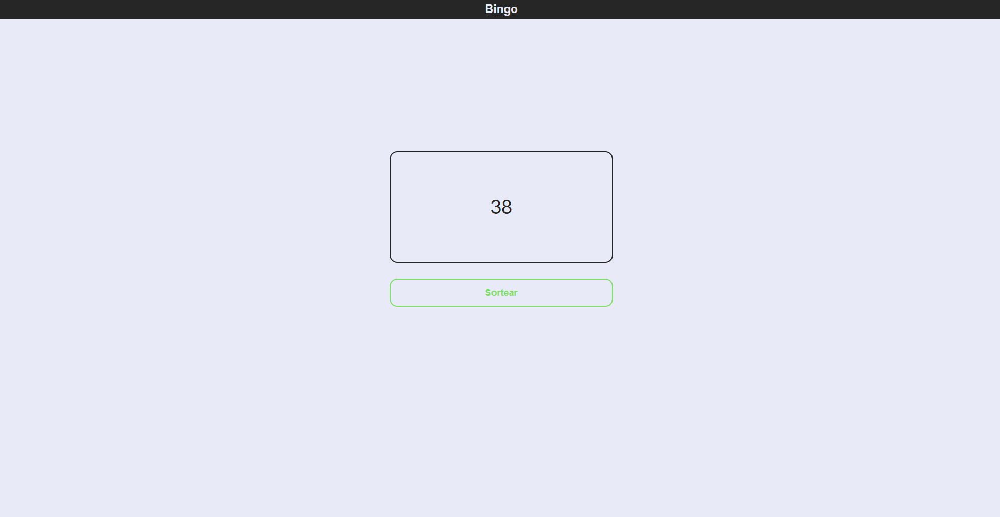
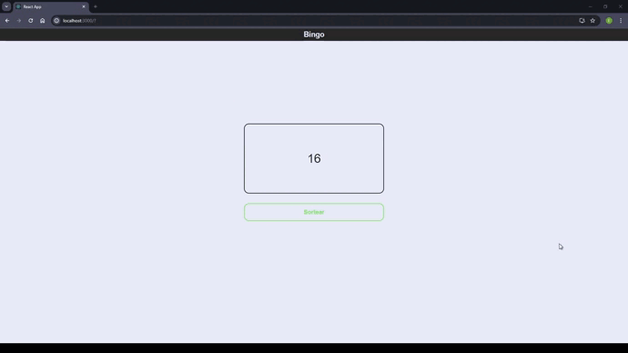

<h1 align="center">
    
</h1>

<h1>
    
</h1>

# Indice

- [Sobre](#-sobre)
- [Tecnologias Utilizadas](#-tecnologias-utilizadas)
- [Como baixar o projeto](#-como-baixar-o-projeto)

## 🔖&nbsp; Sobre

O projeto **Bingo** é um game de bingo para se divertir com os amigos e familiares. Projeto desenvolvido com intuito da prática da lógica de programação.

---

## 🚀 Tecnologias utilizadas

O projeto foi desenvolvido utilizando as seguintes tecnologias

- [ReactJS](https://reactjs.org)
- [Styled Components](https://styled-components.com/)

---

## 🗂 Como baixar o projeto

```bash

    # Clonar o repositório
    $ git clone https://github.com/eduardopvieira16/bingo-react

    # Entrar no diretório
    $ cd bingo-react

    # Instalar as dependências
    $ yarn install

    # Iniciar o projeto
    $ yarn start
```

---

Desenvolvido 💜 por Eduardo Vieira
=======